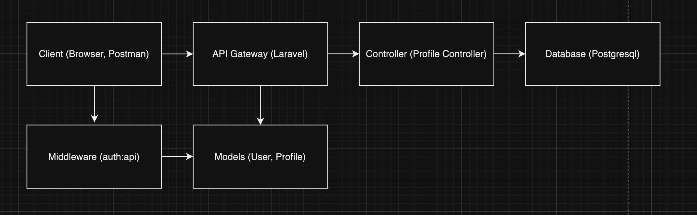
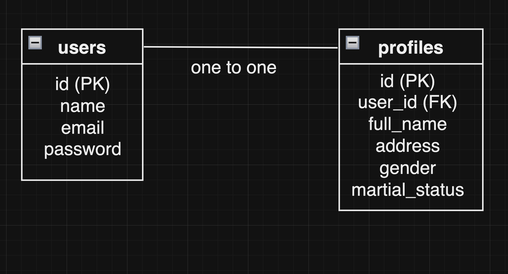

# Backend Toonesia API Documentation

## Rancangan Arsitektur Backend


## ERD


## BaseUrl
http://localhost:8000/api

## Endpoint

### 1. Register User
- URL : /register
- Method : POST
- Description: Membuat pengguna baru.
- Request Body :
```
{
  "name": "John Doe",
  "email": "john@example.com",
  "password": "password",
  "password_confirmation": "password"
}
```
- Response :
```
{
  "token": "jwt-token-here"
}
```

### 2. Login User
- URL : /login
- Method : POST
- Description: Login dan dapatkan token autentikasi.
- Request Body :
```
{
  "email": "john@example.com",
  "password": "password"
}
```
- Response :
```
{
  "token": "jwt-token-here"
}
```

### 3. Get Authenticated User's Profile
- URL : /profile
- Method : GET
- Description : Mengambil profil pengguna yang sedang login.
- Headers :
```
Authorization: Bearer <token>
```
- Response :
```
{
  "id": 1,
  "user_id": 1,
  "full_name": "John Doe",
  "address": "123 Main St",
  "gender": "male",
  "marital_status": "single"
}
```
### 4. Create Profile
- URL : /profile
- Method : POST
- Description : Membuat profil baru untuk pengguna yang sedang login.
- Headers :
```
Authorization: Bearer <token>
```
- Request Body : 
```
{
  "full_name": "John Doe",
  "address": "123 Main St",
  "gender": "male",
  "marital_status": "single"
}
```
- Response :
```
{
  "id": 1,
  "user_id": 1,
  "full_name": "John Doe",
  "address": "123 Main St",
  "gender": "male",
  "marital_status": "single"
}
```

### 5. Update Profile
- URL : /profile/{id}
- Method : PUT
- Description : Memperbarui profil pengguna yang sedang login.
- Headers :
```
Authorization: Bearer <token>
```
- Request Body : 
```
{
  "full_name": "John Doe Updated",
  "address": "456 Another St",
  "gender": "male",
  "marital_status": "married"
}
```
- Response :
```
{
  "id": 1,
  "user_id": 1,
  "full_name": "John Doe Updated",
  "address": "456 Another St",
  "gender": "male",
  "marital_status": "married"
}
```

### 6. Delete Profile
- URL : /profile/{id}
- Method : DELETE
- Description : Menghapus profil pengguna yang sedang login.
- Headers :
```
Authorization: Bearer <token>
```
- Response :
```
{
  "message": "Profile deleted successfully"
}
```

### Error Handling
- 401 Unauthorized: Jika autentikasi gagal atau token tidak valid.
```
{
  "message": "Unauthenticated."
}
```
- 404 Not Found: Jika profil tidak ditemukan.
```
{
  "message": "Profile not found"
}
```
- 400 Bad Request: Jika ada kesalahan dalam validasi data input.
```
{
  "message": "Validation Error",
  "errors": {
    "full_name": ["The full name field is required."]
  }
}

```